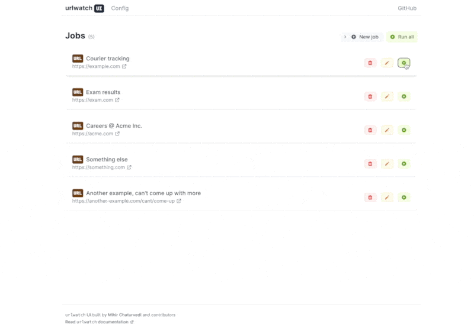

# `urlwatch` UI

> 🌐 An intuitive and simple GUI for managing [`urlwatch`](https://github.com/thp/urlwatch).

**`urlwatch` UI** is a web-based UI for managing jobs on [`urlwatch`](https://github.com/thp/urlwatch), with easy configuration and quick to get started.

  

## Installation

### Prerequisites

- Node.js v16+
- `pnpm`/`npm`/`yarn` package manager

I use `pnpm` as my package manager, although `npm` or `yarn` should work too.

### Build

1. Clone this repo and enter the repo directory.
2. `pnpm install` to install the dependencies.
3. `pnpm build` to build the production files.
4. `pnpm start` to start the server.

> You can specifiy the server port through the `PORT` environment variable.
>
> Example: `PORT=3000 pnpm start`

### Development

This web app is build using [SvelteKit](https://kit.svelte.dev/), TypeScript and Tailwind.

`pnpm dev` to start the dev server. The rest is pretty simple.

## TODO

- [ ] Dockerize app installation and setup
- [ ] Add all job configurations (filters, etc.) when adding a new job, and editing and existing job.

## License

[MIT](LICENSE)

---

Additionally, many thanks to [Thomas Perl](https://github.com/thp) for creating `urlwatch`. `urlwatch` is © 2022 Thomas Perl.
